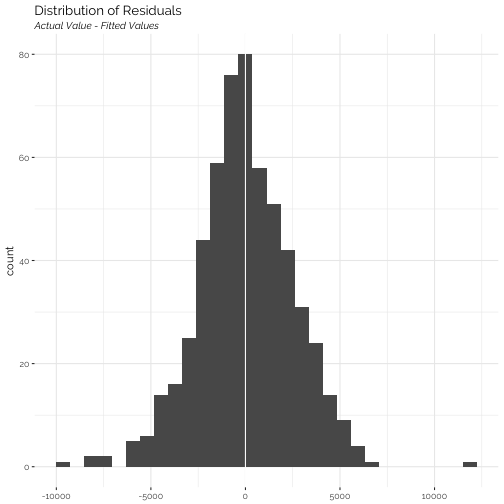

# Welcome!
Welcome to `model.plot`! `model.plot` is an R package designed to make it easier to plot, interact with, and interpret your basic model results. 

# Installation

```r
devtools::install_github("harader/model.plot")
libary(model.plot)
```

# Usage
Let's load some data from the ISLR package and play around


```r
library(ISLR)
summary(College)
```

This looks like an interesting data set about colleges! Let's subset to only private colleges, and run a regression on out of state tuition:


```r
my_model <- lm(Outstate ~ perc.alumni + Grad.Rate + Top10perc + PhD + Terminal, data = College[College$Private == "Yes", ])

# Standard plot
plot(my_model)
```


Cool! Now let's say we want to see all variables, not just where p < .05

```r
plot(my_model, p = 1)
```


And now a bar plot...

```r
bar_plot(my_model)
```


And a table...

```r
stat_table(my_model)
```


And a histogram of residuals...

```r
plot_residuals(my_model)
```

```
## `stat_bin()` using `bins = 30`. Pick better value with `binwidth`.
```


Woohoo! Happy Plotting!
